# Diagram sekwencji - Autentykacja

<authentication_analysis>
Na podstawie analizy PRD, specyfikacji autentykacji i istniejącego codebase zidentyfikowano następujące przepływy autentykacji:

**Główne przepływy autentykacji:**
1. **Rejestracja użytkownika** - email + hasło (bez weryfikacji emaila)
2. **Logowanie użytkownika** - email + hasło z opcją "Remember me"
3. **Reset hasła** - dwuetapowy proces (żądanie + reset z tokenem)
4. **Wylogowanie** - czyszczenie sesji i tokenów
5. **Ochrona tras** - middleware sprawdza uwierzytelnienie
6. **Odświeżanie tokenów** - automatyczne dla aktywnych sesji

**Główni aktorzy i ich interakcje:**
1. **Przeglądarka** - interfejs użytkownika, formularze React, przechowywanie tokenów w localStorage
2. **Middleware** - weryfikacja tokenów, ochrona chronionych tras, przekierowania
3. **Astro API** - endpointy auth (/api/auth/*), walidacja danych, obsługa błędów
4. **Supabase Auth** - usługa uwierzytelnienia, JWT tokeny, zarządzanie sesjami

**Procesy weryfikacji i odświeżania tokenów:**
- Middleware sprawdza token w każdym żądaniu do chronionej trasy
- Supabase automatycznie odświeża tokeny 5 minut przed wygaśnięciem
- useAuth hook nasłuchuje zmian stanu autentykacji
- Session cookies ustawiane opcjonalnie dla "Remember me"

**Opis kroków autentykacji:**
1. **Sprawdzenie stanu auth**: useAuth hook sprawdza istniejącą sesję przy załadowaniu
2. **Logowanie**: formularz → API endpoint → Supabase → zwrócenie tokenu → aktualizacja stanu
3. **Middleware protection**: żądanie → sprawdzenie tokenu → przekierowanie lub kontynuacja
4. **Token refresh**: automatyczne odświeżanie przed wygaśnięciem
5. **Wylogowanie**: czyszczenie lokalnego stanu i cookie sesji
6. **Reset hasła**: email → token → nowe hasło → aktualizacja w Supabase

```mermaid
sequenceDiagram
    autonumber
    participant Browser as Przeglądarka
    participant Middleware as Middleware
    participant AstroAPI as Astr API
    participant Supabase as Supabase Auth

    %% Inicjalne sprawdzenie stanu autentykacji
    Note over Browser,Supabase: Inicjalizacja aplikacji
    Browser->>Browser: Załadowanie strony (useAuth hook)
    Browser->>Supabase: Sprawdzenie istniejącej sesji
    Supabase-->>Browser: Stan sesji (token lub null)
    
    alt Użytkownik ma ważną sesję
        Browser->>Browser: Ustawienie stanu zalogowanego
        Browser->>Browser: Renderowanie AuthenticatedNav
    else Brak sesji
        Browser->>Browser: Ustawienie stanu niezalogowanego
        Browser->>Browser: Renderowanie UnauthenticatedNav
    end

    %% Przepływ rejestracji
    Note over Browser,Supabase: Proces rejestracji
    Browser->>Browser: Kliknięcie "Signup" / Wypełnienie formularza
    Browser->>AstroAPI: POST /api/auth/signup (email, password)
    
    activate AstroAPI
    AstroAPI->>AstroAPI: Walidacja danych (Zod schema)
    AstroAPI->>Supabase: signUp(email, password)
    
    alt Rejestracja pomyślna
        Supabase-->>AstroAPI: { user, session }
        AstroAPI-->>Browser: Sukces + dane użytkownika
        Browser->>Browser: Komunikat sukcesu
        Browser->>Browser: Przekierowanie do /plans
    else Błąd rejestracji
        Supabase-->>AstroAPI: Błąd (email zajęty, słabe hasło)
        AstroAPI-->>Browser: Komunikat błędu
        Browser->>Browser: Wyświetlenie błędu w formularzu
    end
    deactivate AstroAPI

    %% Przepływ logowania
    Note over Browser,Supabase: Proces logowania
    Browser->>Browser: Kliknięcie "Login" / Wypełnienie formularza
    Browser->>AstroAPI: POST /api/auth/login (email, password, rememberMe?)
    
    activate AstroAPI
    AstroAPI->>AstroAPI: Walidacja danych
    AstroAPI->>Supabase: signInWithPassword(email, password)
    
    alt Logowanie pomyślne
        Supabase-->>AstroAPI: { user, session, access_token }
        
        alt RememberMe = true
            AstroAPI->>AstroAPI: Ustawienie session cookie
        end
        
        AstroAPI-->>Browser: Sukces + token + dane użytkownika
        Browser->>Browser: Zapisanie tokenu (localStorage)
        Browser->>Browser: Aktualizacja stanu auth (zalogowany)
        Browser->>Browser: Przekierowanie do /plans lub redirect URL
    else Błąd logowania
        Supabase-->>AstroAPI: Błąd (nieprawidłowe dane)
        AstroAPI-->>Browser: Komunikat błędu
        Browser->>Browser: Wyświetlenie błędu w formularzu
    end
    deactivate AstroAPI

    %% Ochrona chronionych tras
    Note over Browser,Supabase: Dostęp do chronionej strony
    Browser->>Middleware: Żądanie GET /plans
    
    activate Middleware
    Middleware->>Middleware: Sprawdzenie czy trasa chroniona
    Middleware->>Middleware: Pobranie tokenu (cookie lub header)
    
    alt Token jest obecny
        Middleware->>Supabase: Weryfikacja tokenu (getUser)
        
        alt Token ważny
            Supabase-->>Middleware: Dane użytkownika
            Middleware->>Middleware: Zapisanie user w context.locals
            Middleware->>Browser: Kontynuacja żądania (200 OK)
        else Token nieważny/wygasły
            Supabase-->>Middleware: Błąd weryfikacji
            Middleware-->>Browser: Przekierowanie 302 /login?redirect=plans
        end
    else Brak tokenu
        Middleware-->>Browser: Przekierowanie 302 /login?redirect=plans
    end
    deactivate Middleware

    %% Proces odświeżania tokenu
    Note over Browser,Supabase: Automatyczne odświeżanie tokenu
    Browser->>Browser: useAuth hook sprawdza wygaśnięcie (co 5 min)
    
    alt Token wygasa za < 5 minut
        Browser->>Supabase: refreshSession(refresh_token)
        
        alt Refresh pomyślny
            Supabase-->>Browser: Nowy access_token + refresh_token
            Browser->>Browser: Aktualizacja tokenów w storage
            Browser->>Browser: Kontynuacja bez przerwy
        else Refresh failed
            Supabase-->>Browser: Błąd odświeżania
            Browser->>Browser: Wylogowanie użytkownika
            Browser->>Browser: Przekierowanie do /login
        end
    end

    %% Reset hasła - Krok 1: Żądanie resetu
    Note over Browser,Supabase: Reset hasła - Żądanie
    Browser->>Browser: Kliknięcie "Forgot Password"
    Browser->>Browser: Wypełnienie formularza (email)
    Browser->>AstroAPI: POST /api/auth/forgot-password (email)
    
    activate AstroAPI
    AstroAPI->>Supabase: resetPasswordForEmail(email, redirectTo)
    Supabase-->>Supabase: Wysłanie emaila z tokenem reset
    Supabase-->>AstroAPI: Zawsze sukces (security)
    AstroAPI-->>Browser: Komunikat sukcesu
    Browser->>Browser: Informacja o wysłaniu emaila
    deactivate AstroAPI

    %% Reset hasła - Krok 2: Ustawienie nowego hasła
    Note over Browser,Supabase: Reset hasła - Nowe hasło
    Browser->>Browser: Kliknięcie linku w emailu
    Browser->>Browser: Przekierowanie /password-reset?token=xyz
    Browser->>Browser: Wypełnienie formularza (nowe hasło)
    Browser->>AstroAPI: POST /api/auth/reset-password (token, password)
    
    activate AstroAPI
    AstroAPI->>AstroAPI: Walidacja tokenu i hasła
    AstroAPI->>Supabase: updateUser(password) z tokenem
    
    alt Reset pomyślny
        Supabase-->>AstroAPI: Sukces aktualizacji
        AstroAPI-->>Browser: Komunikat sukcesu
        Browser->>Browser: Informacja o resecie + link do logowania
    else Błąd resetu
        Supabase-->>AstroAPI: Błąd (token wygasły/nieprawidłowy)
        AstroAPI-->>Browser: Komunikat błędu
        Browser->>Browser: Opcja żądania nowego tokenu
    end
    deactivate AstroAPI

    %% Wylogowanie
    Note over Browser,Supabase: Proces wylogowania
    Browser->>Browser: Kliknięcie "Logout" w UserDropdown
    Browser->>AstroAPI: POST /api/auth/logout
    
    activate AstroAPI
    AstroAPI->>Supabase: signOut()
    Supabase-->>AstroAPI: Potwierdzenie wylogowania
    AstroAPI->>AstroAPI: Czyszczenie session cookie
    AstroAPI-->>Browser: Potwierdzenie wylogowania
    Browser->>Browser: Czyszczenie lokalnych tokenów
    Browser->>Browser: Aktualizacja stanu (niezalogowany)
    Browser->>Browser: Renderowanie UnauthenticatedNav
    deactivate AstroAPI

    %% Obsługa błędów API
    Note over Browser,Supabase: Obsługa błędów i przekierowań
    
    alt Użytkownik zalogowany próbuje /login
        Browser->>Middleware: GET /login
        Middleware->>Middleware: Sprawdzenie auth + isAuthRoute
        Middleware-->>Browser: Przekierowanie 302 /plans
    end
    
    alt Wygaśnięcie sesji podczas działania
        Browser->>AstroAPI: Żądanie API z nieważnym tokenem
        AstroAPI->>Supabase: Weryfikacja tokenu
        Supabase-->>AstroAPI: 401 Unauthorized
        AstroAPI-->>Browser: 401 + komunikat błędu
        Browser->>Browser: useAuth detectuje błąd
        Browser->>Browser: Automatyczne wylogowanie
        Browser->>Browser: Przekierowanie do /login
    end
```

</authentication_analysis>

<mermaid_diagram>

</mermaid_diagram> 