# Diagram UI - Moduł Autentykacji

<architecture_analysis>
Na podstawie analizy PRD, specyfikacji autentykacji i istniejącego codebase zidentyfikowano następujące komponenty:

**Strony Astro (Server-Side):**
1. `/login` - src/pages/login.astro - renderuje LoginForm z wykorzystaniem AuthLayout
2. `/signup` - src/pages/signup.astro - renderuje SignupForm (specyfikacja)
3. `/password-reset` - strona resetowania hasła (specyfikacja)
4. `/profile` - panel edycji profilu (specyfikacja)
5. `/` - src/pages/index.astro - landing page z Header zawierającym auth navigation

**Komponenty React (Client-Side):**
1. AuthLayout - wspólny layout dla wszystkich formularzy uwierzytelniania
2. LoginForm - formularz logowania z walidacją
3. SignupForm - formularz rejestracji (email + hasło bez potwierdzenia)
4. ForgotPasswordForm - formularz żądania resetu hasła (specyfikacja)
5. ResetPasswordForm - formularz ustawiania nowego hasła (specyfikacja)
6. ProfileForm - formularz edycji profilu (specyfikacja)
7. Header - główna nawigacja adaptująca się do stanu auth
8. UnauthenticatedNav - nawigacja dla niezalogowanych (Login/Signup przyciski)
9. AuthenticatedNav - nawigacja dla zalogowanych (UserDropdown)
10. UserDropdown - dropdown z opcjami "Moje plany" i "Wyloguj"

**Komponenty pomocnicze:**
1. FormField - uniwersalne pole formularza z walidacją
2. ErrorMessage - wyświetlanie komunikatów błędów
3. SuccessMessage - komunikaty sukcesu operacji
4. Logo - logo aplikacji używane w AuthLayout i Header

**Hooks i utilities:**
1. useAuth - zarządzanie stanem uwierzytelnienia i integracja z Supabase
2. useForm - walidacja formularzy
3. useNavigation - obsługa nawigacji między stronami

**API Endpoints (z spec.):**
1. POST /api/auth/login - logowanie
2. POST /api/auth/signup - rejestracja
3. POST /api/auth/logout - wylogowanie
4. POST /api/auth/forgot-password - żądanie resetu hasła
5. POST /api/auth/reset-password - reset hasła z tokenem
6. PUT /api/auth/profile - aktualizacja profilu

**Przepływ danych:**
- Middleware sprawdza uwierzytelnienie dla chronionych tras
- Header komponuje się różnie w zależności od stanu auth
- Formularze używają useForm do walidacji i useAuth do komunikacji z API
- Wszystkie auth komponenty korzystają ze wspólnego AuthLayout
- Navigation hooks zarządzają przekierowaniami między stronami

**Funkcjonalność każdego komponentu:**
- AuthLayout: Centralizuje wygląd stron auth (logo, tytuł, kontener)
- LoginForm: Logowanie z email/hasło + "zapomniałem hasła" + redirect do signup
- SignupForm: Rejestracja tylko email/hasło (bez potwierdzenia) + redirect do login
- Header: Adaptacyjna nawigacja z logo i auth-dependent menu
- UnauthenticatedNav: Przyciski Login i Signup
- AuthenticatedNav: UserDropdown z opcjami dla zalogowanych
- FormField: Reużywalne pole z walidacją i accessibility
- useAuth: Centralne zarządzanie stanem auth + Supabase integration

```mermaid
flowchart TD
    %% Middleware i ochrona tras
    MW[Middleware Auth Guard] --> LP[Landing Page /]
    MW --> LO[Login Page /login]
    MW --> SU[Signup Page /signup]
    MW --> PR[Password Reset /password-reset]
    MW --> PF[Profile Page /profile]
    MW --> PLN[Plans Page /plans]
    
    %% Landing Page structure
    LP --> HDR[Header Component]
    HDR --> LOGO[Logo Component]
    HDR --> |"Stan auth false"| UNAV[UnauthenticatedNav]
    HDR --> |"Stan auth true"| ANAV[AuthenticatedNav]
    
    %% Navigation components
    UNAV --> LBTN[LoginButton]
    UNAV --> SBTN[SignupButton]
    ANAV --> UDRP[UserDropdown]
    UDRP --> UICO[UserIcon]
    
    %% Auth Layout structure
    subgraph "Wspólny Auth Layout"
        AL[AuthLayout Component]
        AL --> LOGO2[Logo]
        AL --> TITLE[Tytuł strony]
        AL --> CONT[Kontener formularza]
    end
    
    %% Login Page
    LO --> AL
    CONT --> LF[LoginForm]
    LF --> FF1[FormField Email]
    LF --> FF2[FormField Password]
    LF --> FP[Forgot Password Link]
    LF --> SUL[Signup Link]
    
    %% Signup Page
    SU --> AL
    CONT --> SF[SignupForm]
    SF --> FF3[FormField Email]
    SF --> FF4[FormField Password]
    SF --> LL[Login Link]
    
    %% Password Reset Pages
    PR --> AL
    CONT --> |"Bez tokenu"| FPF[ForgotPasswordForm]
    CONT --> |"Z tokenem"| RPF[ResetPasswordForm]
    FPF --> FF5[FormField Email]
    RPF --> FF6[FormField New Password]
    RPF --> FF7[FormField Confirm Password]
    
    %% Profile Page
    PF --> AL
    CONT --> PRF[ProfileForm]
    PRF --> FF8[FormField Current Password]
    PRF --> FF9[FormField New Password]
    
    %% Form Field Components
    subgraph "Komponenty pomocnicze formularzy"
        FF[FormField Component]
        EM[ErrorMessage]
        SM[SuccessMessage]
    end
    
    %% Hooks and State Management
    subgraph "Zarządzanie stanem i hooks"
        UA[useAuth Hook]
        UF[useForm Hook]
        UN[useNavigation Hook]
        AS[AuthState]
    end
    
    %% API Integration
    subgraph "API Endpoints"
        API1[POST /api/auth/login]
        API2[POST /api/auth/signup]  
        API3[POST /api/auth/logout]
        API4[POST /api/auth/forgot-password]
        API5[POST /api/auth/reset-password]
        API6[PUT /api/auth/profile]
    end
    
    %% Supabase Integration
    subgraph "Supabase Auth"
        SB[Supabase Client]
        SBAUTH[Supabase Auth Methods]
    end
    
    %% Connections between hooks and components
    HDR --> UA
    LF --> UA
    LF --> UF
    SF --> UA
    SF --> UF
    FPF --> UF
    RPF --> UF
    PRF --> UA
    PRF --> UF
    
    %% API connections
    UA --> API1
    UA --> API2
    UA --> API3
    UA --> API4
    UA --> API5
    UA --> API6
    
    %% Supabase connections
    API1 --> SB
    API2 --> SB
    API3 --> SB
    API4 --> SB
    API5 --> SB
    API6 --> SB
    SB --> SBAUTH
    
    %% Navigation connections
    LBTN --> UN
    SBTN --> UN
    SUL --> UN
    LL --> UN
    FP --> UN
    UDRP --> UN
    
    %% Form validation and messages
    LF --> EM
    LF --> SM
    SF --> EM
    SF --> SM
    FPF --> EM
    FPF --> SM
    RPF --> EM
    RPF --> SM
    PRF --> EM
    PRF --> SM
    
    %% Protected routes
    MW -.-> |"Redirect to /login"| LO
    PLN -.-> |"Wymaga auth"| MW
    PF -.-> |"Wymaga auth"| MW
    
    %% Auth state flow
    UA --> AS
    AS --> HDR
    AS --> MW
    
    %% Styling and classes
    classDef astroPage fill:#e1f5fe,stroke:#0277bd,stroke-width:2px
    classDef reactComponent fill:#f3e5f5,stroke:#7b1fa2,stroke-width:2px
    classDef authComponent fill:#fff3e0,stroke:#f57c00,stroke-width:2px
    classDef apiEndpoint fill:#e8f5e8,stroke:#388e3c,stroke-width:2px
    classDef hookUtility fill:#fce4ec,stroke:#c2185b,stroke-width:2px
    classDef supabaseService fill:#f1f8e9,stroke:#689f38,stroke-width:2px
    
    %% Apply styles
    class LP,LO,SU,PR,PF,PLN astroPage
    class HDR,UNAV,ANAV,UDRP,LBTN,SBTN,UICO,LOGO,LOGO2 reactComponent
    class AL,LF,SF,FPF,RPF,PRF,FF,FF1,FF2,FF3,FF4,FF5,FF6,FF7,FF8,FF9,EM,SM authComponent
    class API1,API2,API3,API4,API5,API6 apiEndpoint
    class UA,UF,UN,AS,MW hookUtility
    class SB,SBAUTH supabaseService
```

</architecture_analysis>

<mermaid_diagram>

</mermaid_diagram> 